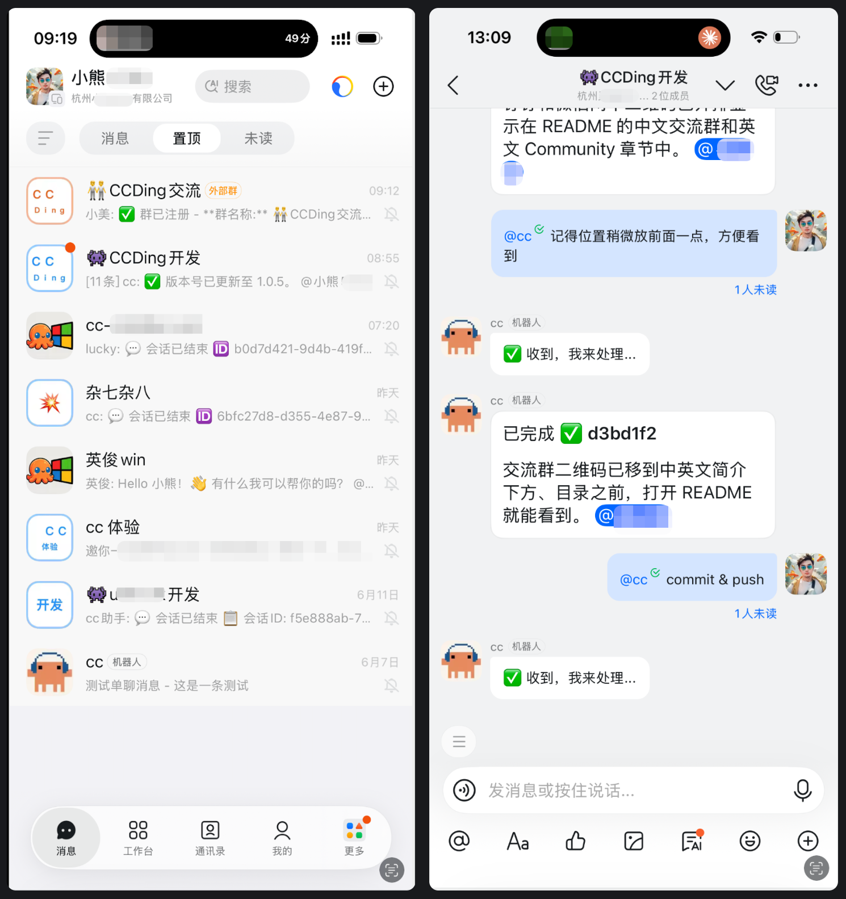

# 手机指挥 AI 干活 —— 把 Claude Code 装进钉钉

> **不用翻墙、不用装 App、不用切窗口。** 在钉钉群里 @机器人，就能写代码、审 PR、跑命令、设定时任务。一行命令接入，GitHub 开源。


---

## 一句话介绍

**cc-ding** 把 Claude Code / Codex 等 AI 编码助手接入钉钉群——团队成员不用任何额外配置，在熟悉的钉钉群里发消息就能用 AI 写代码、审代码、跑命令。支持 Claude、Codex 等多模型，自由切换。



---

## 特点

- **大厂实战打磨**：真实钉钉群场景验证，不是玩具项目
- **支持 Claude / Codex 等多模型**：接入 Anthropic Claude、OpenAI Codex 等，自由切换
- **跨平台**：macOS / Linux / **Windows** 都能跑
- **接入极简**：一行安装 + 一行初始化，3 分钟上线
- **简单实用**：没有复杂配置，上手就能用

---

## 3 分钟接入

### 安装

```bash
npm i cc-ding -g
```

### 初始化

```bash
cc-ding init \
  -ci {钉钉ClientId} \
  -cs {钉钉Stream密钥} \
  -u {管理员手机号} \
  -dt {兜底机器人Token}
```

### 启动

```bash
pm2 start --name "cc-ding" npx -- -p cc-ding cc-ding run -ci {clientId}
```

群里 @cc助手，就能用了。

---

## 使用演示

### 群里写代码

> 👤 `帮我写一个 Python 脚本，把 CSV 转成 JSON`
>
> 🤖 3 秒后返回完整代码，支持中文编码，直接能用。

### 截图排障

> 👤 发一张终端报错截图
>
> 🤖 识别图片，分析原因，给出修复命令。

### 定时任务

> 👤 `每个工作日18点总结今天群里的任务完成情况发到群里`
>
> 🤖 自动生成 cron 表达式 `0 18 * * 1-5`，定时执行。

### 代码审查

> 👤 `审查这个 PR，重点关注安全性和性能`（附链接）
>
> 🤖 发现 SQL 注入风险、N+1 查询等问题，逐条列出。

### 多轮对话 & 任务队列

- 支持上下文多轮对话，AI 记得前面聊了什么
- `/task` 派任务自动排队，多人同时用不打架
- 会话自动持久化，重启无缝恢复

---

## 为什么好用？

| 以前 | 现在 |
|------|------|
| 开终端 → 切 Claude → 复制粘贴 → 等结果 → 截图回群 | 钉钉群里一句话 |
| 配 Jenkins/脚本搞定时任务 | `/cron 自然语言` 3 秒搞定 |
| 新人要熟悉一堆工具 | 会用钉钉就行 |
| 问答散落在各处，事后找不到 | 会话自动持久化，随时恢复 |

---

## 安全

- **可私有化部署**：数据跑在自己服务器
- **白名单机制**：群级 + 全局双层，只让授权的人用
- **命令审计**：`/bash` 执行记录记入日志，可追溯
- **密钥不写死**：支持环境变量引用
- **权限分级**：owner / 管理员 / 普通用户

---

## 项目信息

| 项目 | 信息 |
|------|------|
| **GitHub** | https://github.com/yihuineng/cc-ding |
| **npm** | https://www.npmjs.com/package/cc-ding |
| **协议** | MIT |

> ⭐ 顺手点个 Star，支持开源！
